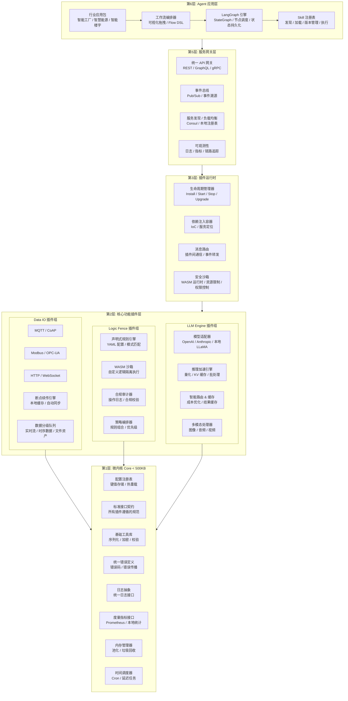

# IoT 通用微内核架构设计

> 设计日期：2026-04-30  
> 架构类型：微内核 + 插件化架构  
> 适用场景：全场景覆盖（嵌入式设备 → 边缘服务器 → 云端集群）

---

## 架构总览

---

## 架构设计原则

### 箭头方向说明

**`A --> B` = A 依赖 B = A 调用 B 提供的服务**

遵循 **依赖倒置原则**：
- 上层依赖下层，下层不依赖上层
- 所有业务插件都只依赖内核抽象
- 内核完全不感知上层业务

### 层级大小约束

| 层级 | 大小约束 | 能否独立运行 | 典型部署场景 |
|------|---------|-------------|-------------|
| 微内核 Core | < 500KB | ✅ 可以 | 任何设备 |
| 核心功能插件 | 每个 1-10MB | ❌ 依赖内核 | 按需加载 |
| 插件运行时 | ~5MB | ❌ 依赖内核 | 边缘服务器以上 |
| 服务网关层 | ~20MB | ❌ 依赖运行时 | 边缘 / 云端 |
| Agent 应用层 | ~50MB | ❌ 依赖下层 | 边缘服务器 / 云端 |

---

## 核心特性矩阵

| 特性模块 | 子特性 | 实现方式 |
|---------|-------|---------|
| **可配置逻辑围栏** | 声明式规则 | YAML/JSON 配置 + 模式匹配引擎 |
| | 沙箱执行 | WASM 运行时 + 资源限制 + 权限控制 |
| | 合规审计 | 操作日志 + 策略校验 |
| **数据 IO 抽象** | 多协议支持 | MQTT / CoAP / Modbus / OPC-UA / HTTP |
| | 边缘本地优先 | 断点续传 + 本地缓存 + 自动同步 |
| | 数据分级 | 实时流 / 时序数据 / 文件资产 分类处理 |
| **LLM 加速与热拔插** | 模型适配器 | 统一接口 + 多厂商支持 |
| | 推理加速 | 量化 / KV 缓存 / 批处理 |
| | 智能路由 | 成本优化 + 结果缓存 + 降级策略 |
| **Agent 编排** | LangGraph | StateGraph + 节点调度 + 状态持久化 |
| | Skill 系统 | 发现 / 加载 / 版本管理 / 组合编排 |

---

## 部署场景配置

### 场景 1：超轻量嵌入式设备
- 加载：`内核 + MQTT 插件 + 规则引擎插件`
- 总大小：~2MB
- 功能：基础数据采集 + 本地规则判定

### 场景 2：边缘网关
- 加载：`内核 + 全量 IO 插件 + 本地 LLM 插件 + Logic Fence`
- 总大小：~50MB
- 功能：协议转换 + 本地推理 + 断点续传 + 合规控制

### 场景 3：云端集群
- 加载：全量插件 + LangGraph + Skill 生态 + 多模型路由
- 总大小：~200MB
- 功能：全功能 Agent 编排 + 多模型协同 + 全局优化

---

*下一节：核心接口契约设计*
